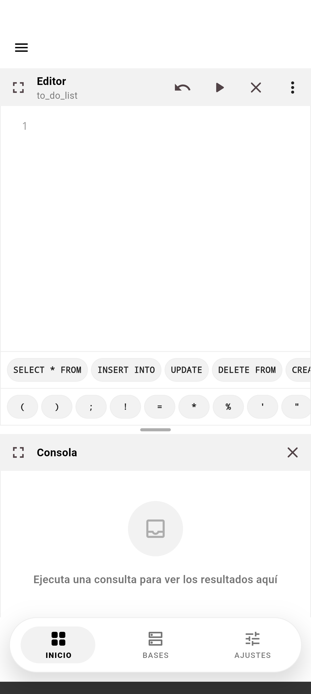
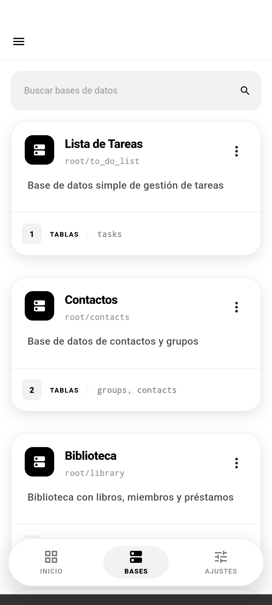
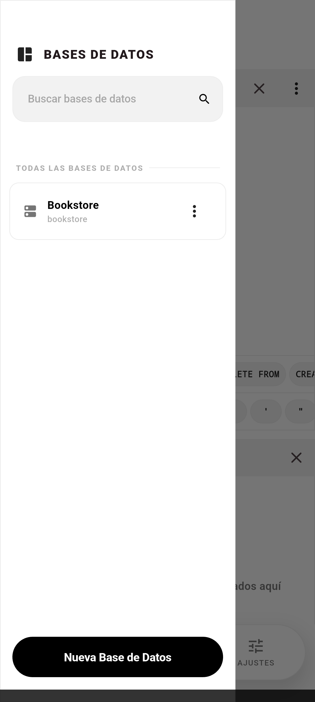
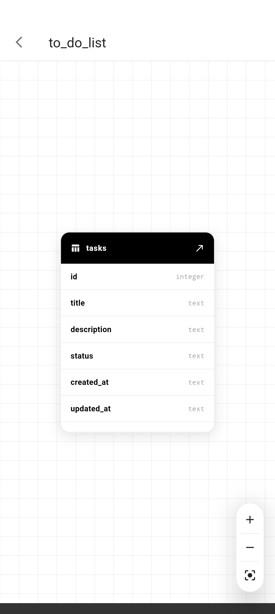
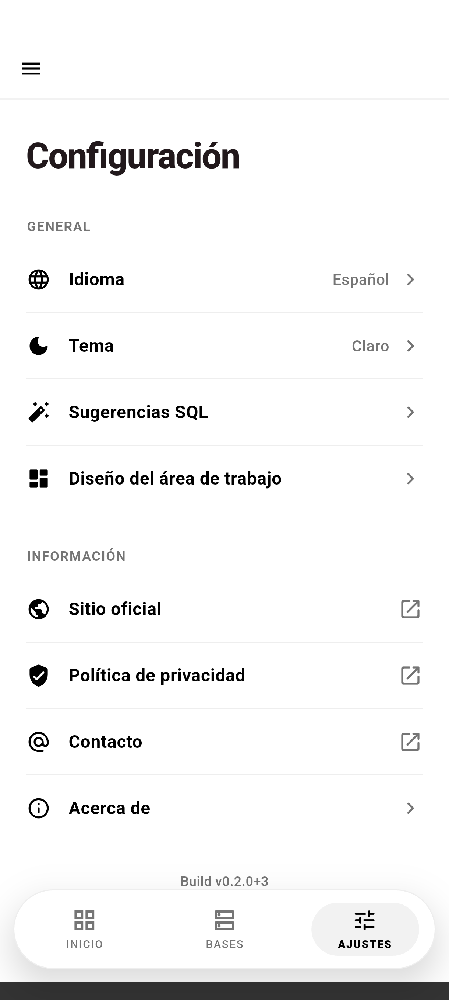
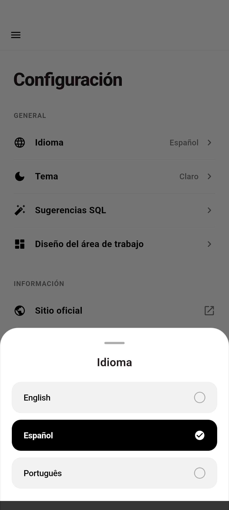
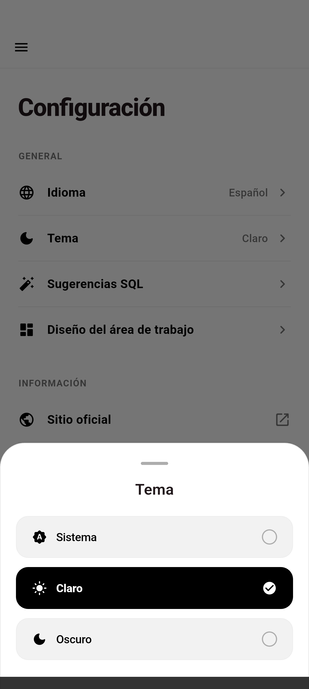
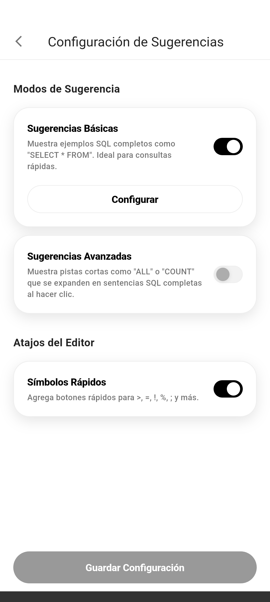
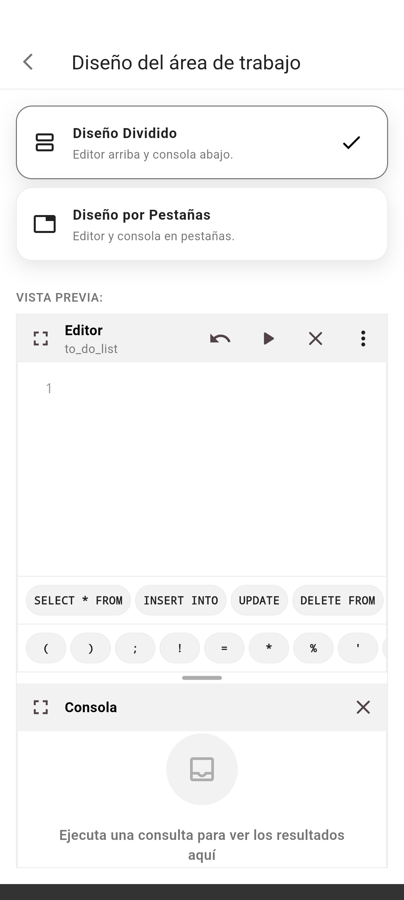

<br>
<div align="center">


</div>
<br>

<p align="center">
<a href="README.md">English</a> · <a href="README.pt-BR.md">Português (BR)</a> · <strong>Español</strong>
</p>

<h1 align="center">SQL Studio</h1>

<p align="center">
Una app Android para practicar SQL en bases de datos SQLite locales, editables y totalmente offline.
<br>
<a href="#acerca-del-proyecto"><strong>Explora la documentación »</strong></a>
<br>
<br>
<a href="https://github.com/dariomatias-dev/sql_studio_app/issues">Reportar Error</a>
·
<a href="https://github.com/dariomatias-dev/sql_studio_app/issues">Solicitar Funcionalidad</a>
</p>

## Índice

- [Acerca del Proyecto](#acerca-del-proyecto)
- [Funcionalidades](#funcionalidades)
- [Capturas de Pantalla](#capturas-de-pantalla)
- [Construido Con](#construido-con)
- [Cómo Empezar](#cómo-empezar)
- [Scripts](#scripts)
- [Contribuir](#contribuir)
- [Licencia](#licencia)
- [Autor](#autor)

## Acerca del Proyecto

**SQL Studio** es un playground de SQL para móviles: un conjunto de bases de datos SQLite listas para usar que puedes consultar, editar y restablecer directamente en tu teléfono, sin servidor ni cuenta necesarios.

Cada base de datos incluye un esquema y datos de seed predefinidos. Escribes y ejecutas SQL real contra ella en un editor de código con resaltado de sintaxis, inspeccionas los resultados en una consola y puedes restablecer la base de datos a su estado original en cualquier momento. Una vista de esquema visual te permite inspeccionar tablas, columnas y relaciones sin escribir una consulta.

## Funcionalidades

- **Bases de Datos SQLite Offline**: Un catálogo de bases de datos locales, cada una con su propio esquema y datos de seed, listas para consultar de inmediato.
- **Editor SQL**: Escribe y ejecuta SQL con resaltado de sintaxis, modo pantalla completa y una consola que muestra los resultados y errores de las consultas.
- **Visualizador de Base de Datos**: Inspecciona las tablas, columnas y estructura de una base de datos de forma visual, sin escribir SQL.
- **Restablecer Base de Datos**: Restaura cualquier base de datos a su esquema y datos de seed originales en cualquier momento.
- **Copiar Esquema y Seed**: Copia el esquema, los datos de seed o ambos de una base de datos al portapapeles.
- **Sugerencias de SQL**: Fragmentos de SQL básicos y avanzados para acelerar la escritura de consultas comunes, activables desde Configuración.
- **Diseño de Workspace Configurable**: Elige cómo se organizan en pantalla el editor, la consola y el visualizador.
- **Múltiples Idiomas**: Interfaz completa en inglés, portugués (Brasil) y español.

## Capturas de Pantalla

<div align="center">










</div>

## Construido Con

- **[Flutter](https://flutter.dev/)**: El toolkit de UI de Google para crear aplicaciones compiladas de forma nativa desde una única base de código.
- **[Dart](https://dart.dev/)**: El lenguaje de programación detrás de Flutter.
- **[Riverpod](https://riverpod.dev/)**: Gestión de estado e inyección de dependencias.
- **[go_router](https://pub.dev/packages/go_router)**: Enrutamiento declarativo.
- **[sqflite](https://pub.dev/packages/sqflite)**: Motor de base de datos SQLite para Flutter.
- **[flutter_code_editor](https://pub.dev/packages/flutter_code_editor)** y **[flutter_highlight](https://pub.dev/packages/flutter_highlight)**: El editor de código y el resaltado de sintaxis usados en el editor SQL.

## Cómo Empezar

El proyecto fija la versión del Flutter SDK mediante [FVM](https://fvm.app/), por lo que todos los comandos siguientes usan `fvm flutter` en lugar de una instalación simple de `flutter`.

```sh
git clone https://github.com/dariomatias-dev/sql_studio_app.git
cd sql_studio_app
fvm install
fvm flutter pub get
```

Luego, ejecuta la app en un dispositivo o emulador conectado:

```sh
fvm flutter run
```

## Scripts

Los scripts de utilidad están en `scripts/`.

| Script       | Comando                             | Descripción                                                                                                                                            |
| ------------ | ------------------------------------ | -------------------------------------------------------------------------------------------------------------------------------------------------------- |
| `screenshot` | `scripts/screenshot.sh [device-id]` | Recorre la app por sus pantallas principales en un dispositivo o emulador conectado y guarda una captura de cada una en `screenshots/<locale>/`, usado en el README, la ficha de Play Store y el sitio oficial. |

## Contribuir

Las contribuciones hacen de la comunidad de código abierto un lugar excelente para aprender y crear. Toda contribución es bienvenida.

Antes de abrir un pull request, consulta [CONTRIBUTING.md](CONTRIBUTING.md) para la configuración local, la convención de mensajes de commit (Conventional Commits) y las reglas de branching de este proyecto.

## Licencia

Distribuido bajo la **Licencia MIT**. Consulta el archivo `LICENSE` para más información.

## Autor

Desarrollado por **Dário Matias Sales**:

- **Portafolio**: [dariomatias-dev](https://dariomatias-dev.com)
- **GitHub**: [dariomatias-dev](https://github.com/dariomatias-dev)
- **Email**: [dariomatias.dev@gmail.com](mailto:dariomatias.dev@gmail.com)
- **Instagram**: [@dariomatias_dev](https://instagram.com/dariomatias_dev)
- **LinkedIn**: [linkedin.com/in/dariomatias-dev](https://linkedin.com/in/dariomatias-dev)
