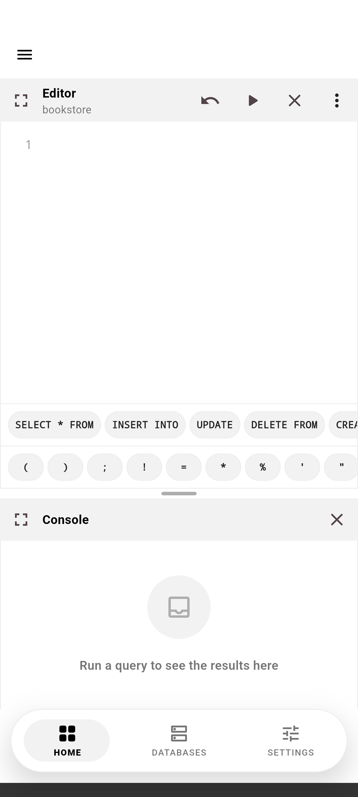
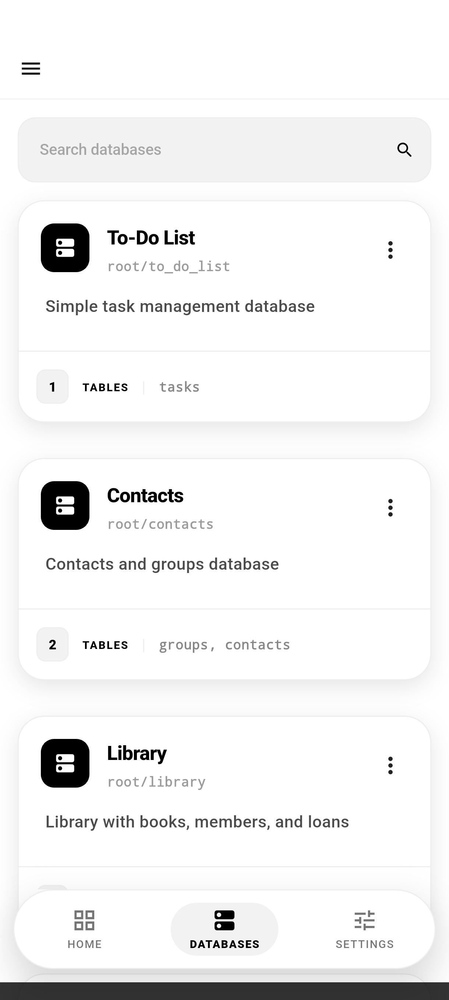
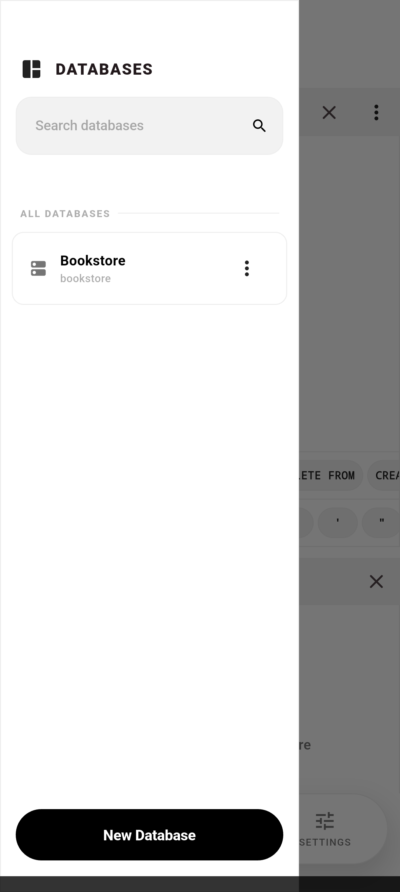
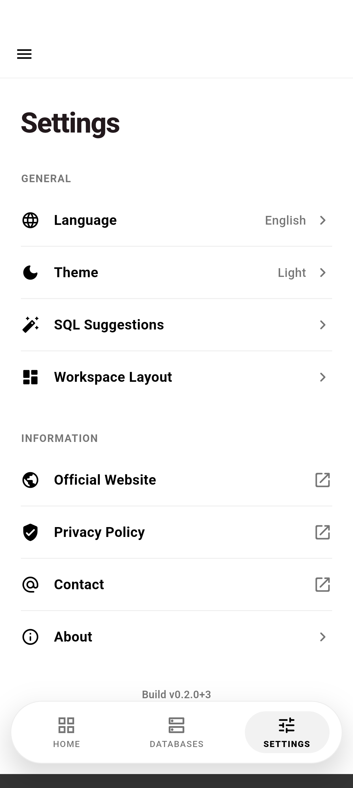
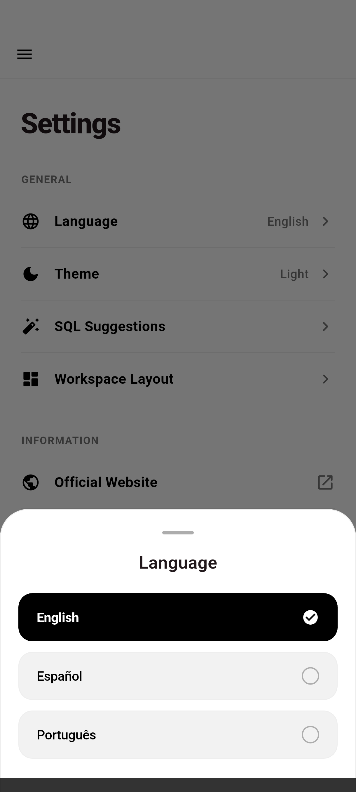
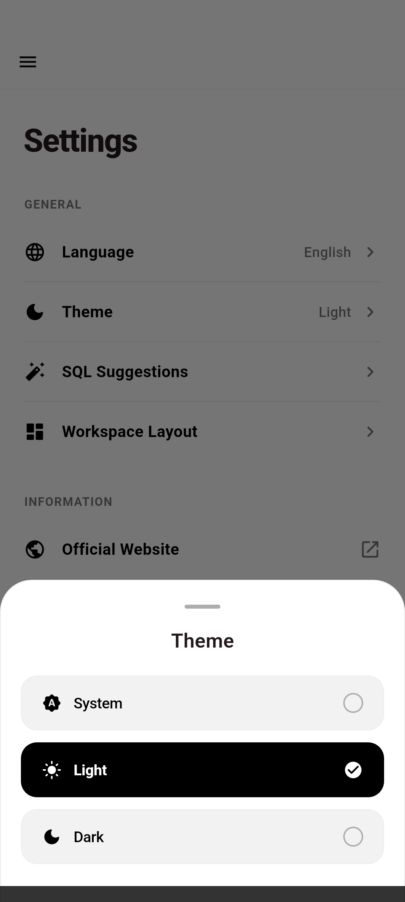
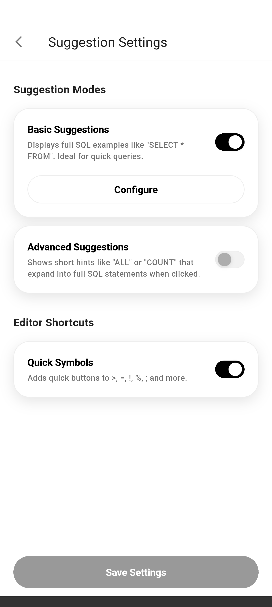
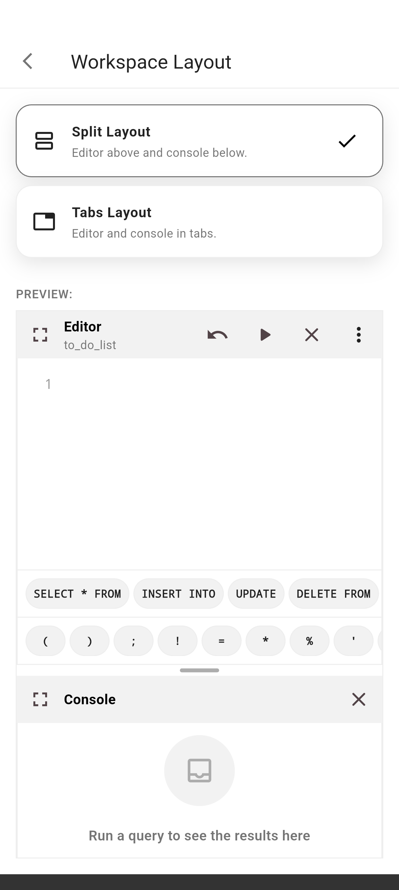

<br>
<div align="center">


</div>
<br>

<p align="center">
<strong>English</strong> · <a href="README.pt-BR.md">Português (BR)</a> · <a href="README.es.md">Español</a>
</p>

<h1 align="center">SQL Studio</h1>

<p align="center">
An Android app to practice SQL on local, editable, fully offline SQLite databases.
<br>
<a href="#about-the-project"><strong>Explore the docs »</strong></a>
<br>
<br>
<a href="https://github.com/dariomatias-dev/sql_studio_app/issues">Report Bug</a>
·
<a href="https://github.com/dariomatias-dev/sql_studio_app/issues">Request Feature</a>
</p>

## Table of Contents

- [About The Project](#about-the-project)
- [Features](#features)
- [Screenshots](#screenshots)
- [Built With](#built-with)
- [Getting Started](#getting-started)
- [Scripts](#scripts)
- [Contributing](#contributing)
- [License](#license)
- [Author](#author)

## About The Project

**SQL Studio** is a mobile SQL playground: a set of ready-made SQLite databases you can query, edit, and reset, right on your phone, with no server or account required.

Each database ships with a predefined schema and seed data. You write and run real SQL against it in a code editor with syntax highlighting, inspect results in a console, and can always reset the database back to its original state. A visual scheme view lets you inspect tables, columns, and relationships without writing a query.

## Features

- **Offline SQLite Databases**: A catalog of local databases, each with its own schema and seed data, ready to query immediately.
- **SQL Editor**: Write and run SQL with syntax highlighting, a fullscreen mode, and a console showing query results and errors.
- **Database Visualizer**: Inspect a database's tables, columns, and structure visually, without writing SQL.
- **Reset Database**: Restore any database to its original schema and seed data at any time.
- **Copy Schema & Seed**: Copy a database's schema, seed data, or both to the clipboard.
- **SQL Suggestions**: Basic and advanced SQL snippets to speed up writing common queries, toggled from Settings.
- **Configurable Workspace Layout**: Choose how the editor, console, and visualizer are arranged on screen.
- **Multiple Languages**: Full app UI in English, Portuguese (Brazil), and Spanish.

## Screenshots

<div align="center">










</div>

## Built With

- **[Flutter](https://flutter.dev/)**: Google's UI toolkit for building natively compiled applications from a single codebase.
- **[Dart](https://dart.dev/)**: The programming language behind Flutter.
- **[Riverpod](https://riverpod.dev/)**: State management and dependency injection.
- **[go_router](https://pub.dev/packages/go_router)**: Declarative routing.
- **[sqflite](https://pub.dev/packages/sqflite)**: SQLite database engine for Flutter.
- **[flutter_code_editor](https://pub.dev/packages/flutter_code_editor)** & **[flutter_highlight](https://pub.dev/packages/flutter_highlight)**: The code editor and syntax highlighting used for the SQL editor.

## Getting Started

The project pins its Flutter SDK version via [FVM](https://fvm.app/), so all commands below use `fvm flutter` rather than a bare `flutter` install.

```sh
git clone https://github.com/dariomatias-dev/sql_studio_app.git
cd sql_studio_app
fvm install
fvm flutter pub get
```

Then run the app on a connected device or emulator:

```sh
fvm flutter run
```

## Scripts

Utility scripts live under `scripts/`.

| Script       | Command                             | Description                                                                                                                                                    |
| ------------ | ------------------------------------ | -------------------------------------------------------------------------------------------------------------------------------------------------------------- |
| `screenshot` | `scripts/screenshot.sh [device-id]` | Drives the app through its main screens on a connected device or emulator and saves a screenshot of each one into `screenshots/<locale>/`, used for the README, Play Store listing, and official website. |

## Contributing

Contributions make the open-source community an amazing place to learn and create. Any contributions you make are greatly appreciated.

Before opening a pull request, see [CONTRIBUTING.md](CONTRIBUTING.md) for the local setup, commit message convention (Conventional Commits), and branching rules this project follows.

## License

Distributed under the **MIT License**. See the `LICENSE` file for more information.

## Author

Developed by **Dário Matias Sales**:

- **Portfolio**: [dariomatias-dev](https://dariomatias-dev.com)
- **GitHub**: [dariomatias-dev](https://github.com/dariomatias-dev)
- **Email**: [dariomatias.dev@gmail.com](mailto:dariomatias.dev@gmail.com)
- **Instagram**: [@dariomatias_dev](https://instagram.com/dariomatias_dev)
- **LinkedIn**: [linkedin.com/in/dariomatias-dev](https://linkedin.com/in/dariomatias-dev)
