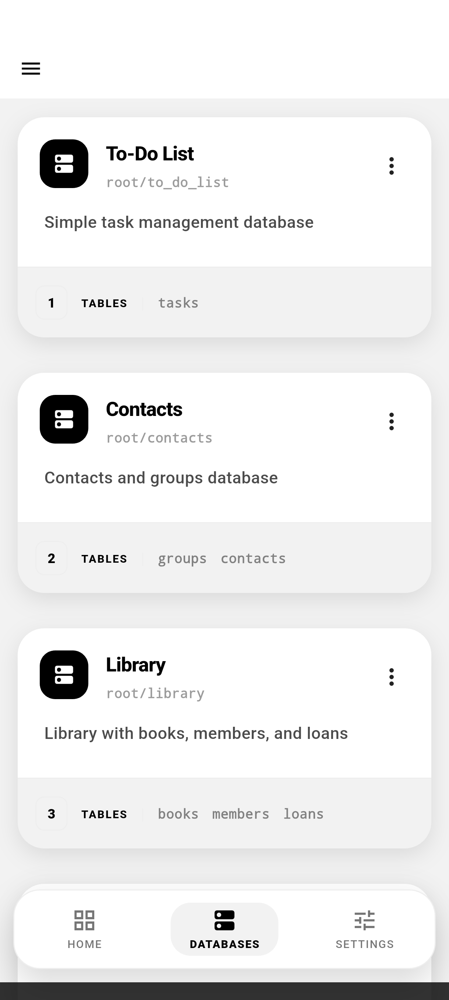
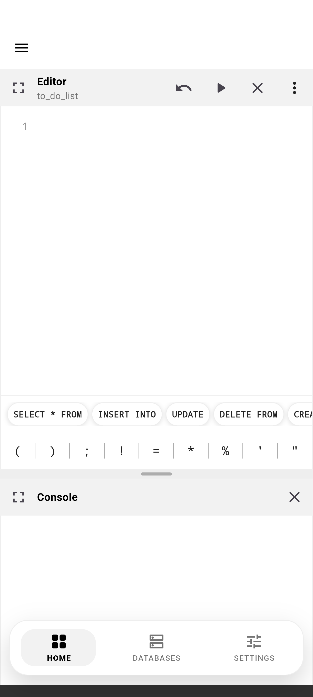
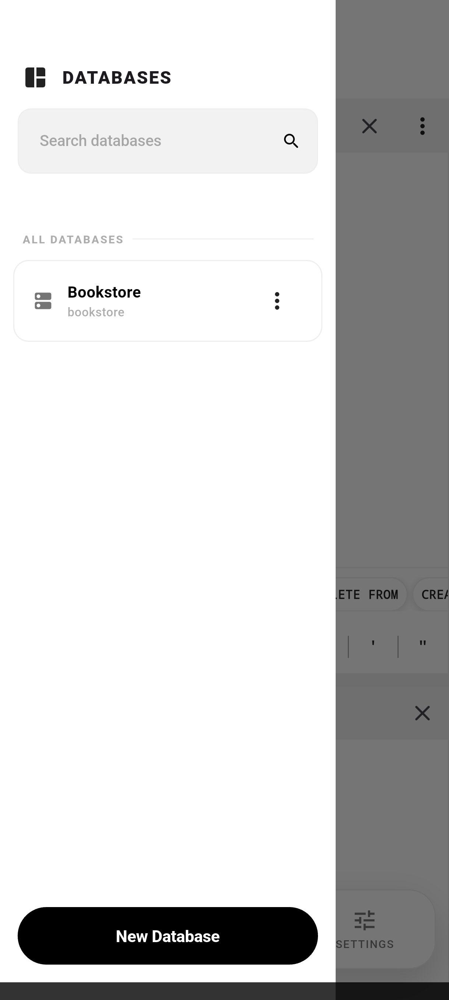
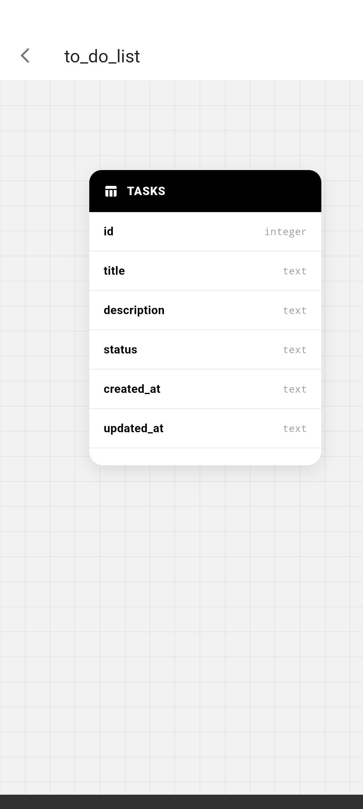
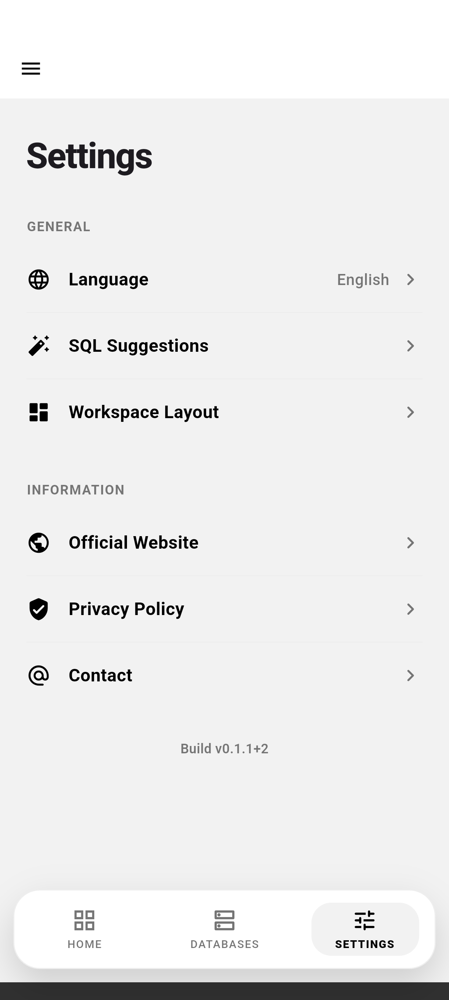
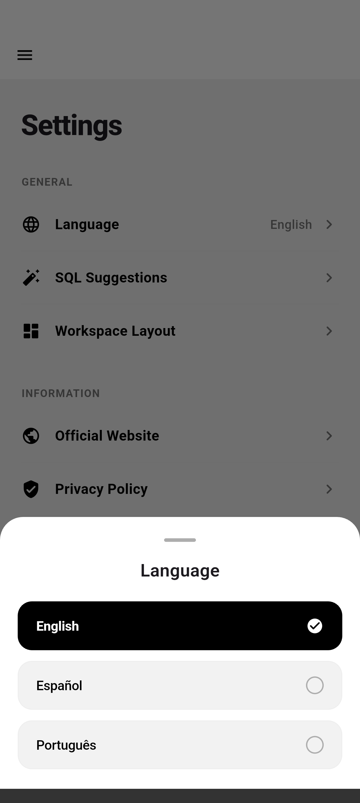
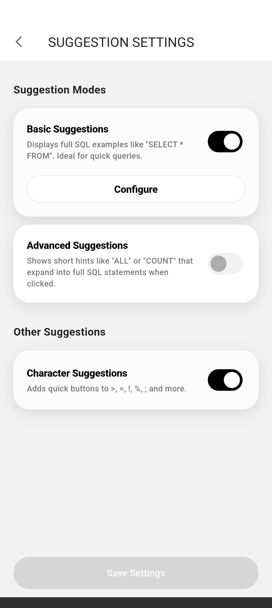
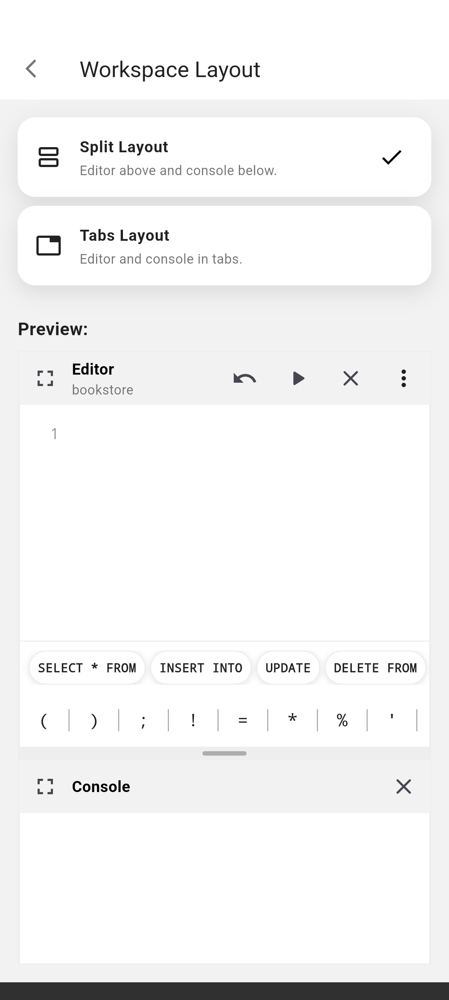

<br>
<div align="center">


</div>
<br>

<p align="center">
<a href="README.md">English</a> · <strong>Português (BR)</strong> · <a href="README.es.md">Español</a>
</p>

<h1 align="center">SQL Studio</h1>

<p align="center">
Um app Android para praticar SQL em bancos SQLite locais, editáveis e totalmente offline.
<br>
<a href="#sobre-o-projeto"><strong>Explore a documentação »</strong></a>
<br>
<br>
<a href="https://github.com/dariomatias-dev/sql_studio_app/issues">Reportar Bug</a>
·
<a href="https://github.com/dariomatias-dev/sql_studio_app/issues">Solicitar Funcionalidade</a>
</p>

## Índice

- [Sobre o Projeto](#sobre-o-projeto)
- [Funcionalidades](#funcionalidades)
- [Screenshots](#screenshots)
- [Construído Com](#construído-com)
- [Como Começar](#como-começar)
- [Scripts](#scripts)
- [Contribuindo](#contribuindo)
- [Licença](#licença)
- [Autor](#autor)

## Sobre o Projeto

**SQL Studio** é um playground de SQL para dispositivos móveis: um conjunto de bancos de dados SQLite prontos que você pode consultar, editar e resetar direto no celular, sem servidor ou conta necessários.

Cada banco de dados vem com um schema e dados de seed predefinidos. Você escreve e executa SQL real contra ele em um editor de código com destaque de sintaxe, inspeciona os resultados em um console, e pode resetar o banco ao estado original a qualquer momento. Uma visualização de esquema visual permite inspecionar tabelas, colunas e relacionamentos sem escrever uma query.

## Funcionalidades

- **Bancos de Dados SQLite Offline**: Um catálogo de bancos locais, cada um com seu próprio schema e dados de seed, prontos para consulta imediata.
- **Editor SQL**: Escreva e execute SQL com destaque de sintaxe, modo tela cheia e um console que exibe resultados e erros das queries.
- **Visualizador de Banco de Dados**: Inspecione as tabelas, colunas e estrutura de um banco de dados visualmente, sem escrever SQL.
- **Resetar Banco de Dados**: Restaure qualquer banco ao seu schema e dados de seed originais a qualquer momento.
- **Copiar Schema e Seed**: Copie o schema, os dados de seed ou ambos de um banco de dados para a área de transferência.
- **Sugestões de SQL**: Snippets de SQL básicos e avançados para agilizar a escrita de queries comuns, ativados em Configurações.
- **Layout de Workspace Configurável**: Escolha como o editor, console e visualizador são organizados na tela.
- **Múltiplos Idiomas**: Interface completa em Inglês, Português (Brasil) e Espanhol.

## Screenshots

<div align="center">









</div>

## Construído Com

- **[Flutter](https://flutter.dev/)**: Toolkit de UI do Google para construir aplicações nativamente compiladas a partir de uma única base de código.
- **[Dart](https://dart.dev/)**: A linguagem de programação por trás do Flutter.
- **[Riverpod](https://riverpod.dev/)**: Gerenciamento de estado e injeção de dependência.
- **[go_router](https://pub.dev/packages/go_router)**: Roteamento declarativo.
- **[sqflite](https://pub.dev/packages/sqflite)**: Motor de banco de dados SQLite para Flutter.
- **[flutter_code_editor](https://pub.dev/packages/flutter_code_editor)** e **[flutter_highlight](https://pub.dev/packages/flutter_highlight)**: O editor de código e o destaque de sintaxe usados no editor SQL.

## Como Começar

O projeto fixa a versão do Flutter SDK via [FVM](https://fvm.app/), então todos os comandos abaixo usam `fvm flutter` em vez de uma instalação simples do `flutter`.

```sh
git clone https://github.com/dariomatias-dev/sql_studio_app.git
cd sql_studio_app
fvm install
fvm flutter pub get
```

Depois, rode o app em um dispositivo ou emulador conectado:

```sh
fvm flutter run
```

## Scripts

Scripts utilitários ficam em `scripts/`.

| Script       | Comando                             | Descrição                                                                                                                                                 |
| ------------ | ------------------------------------ | ------------------------------------------------------------------------------------------------------------------------------------------------------- |
| `screenshot` | `scripts/screenshot.sh [device-id]` | Navega o app sozinho pelas telas principais em um dispositivo ou emulador conectado e salva um screenshot de cada uma em `assets/screenshots/`, usado no README, na listagem da Play Store e no site oficial. |

## Contribuindo

Contribuições tornam a comunidade open-source um lugar incrível para aprender e criar. Qualquer contribuição que você fizer é muito bem-vinda.

1. Faça um fork do projeto
2. Crie sua branch de funcionalidade (`git checkout -b feature/minha-funcionalidade`)
3. Faça commit das suas alterações seguindo a convenção [Conventional Commits](https://www.conventionalcommits.org/)
4. Envie para a branch (`git push origin feature/minha-funcionalidade`)
5. Abra um pull request

## Licença

Distribuído sob a **Licença MIT**. Veja o arquivo `LICENSE` para mais informações.

## Autor

Desenvolvido por **Dário Matias Sales**:

- **Portfólio**: [dariomatias-dev](https://dariomatias-dev.com)
- **GitHub**: [dariomatias-dev](https://github.com/dariomatias-dev)
- **Email**: [dariomatias.dev@gmail.com](mailto:dariomatias.dev@gmail.com)
- **Instagram**: [@dariomatias_dev](https://instagram.com/dariomatias_dev)
- **LinkedIn**: [linkedin.com/in/dariomatias-dev](https://linkedin.com/in/dariomatias-dev)
