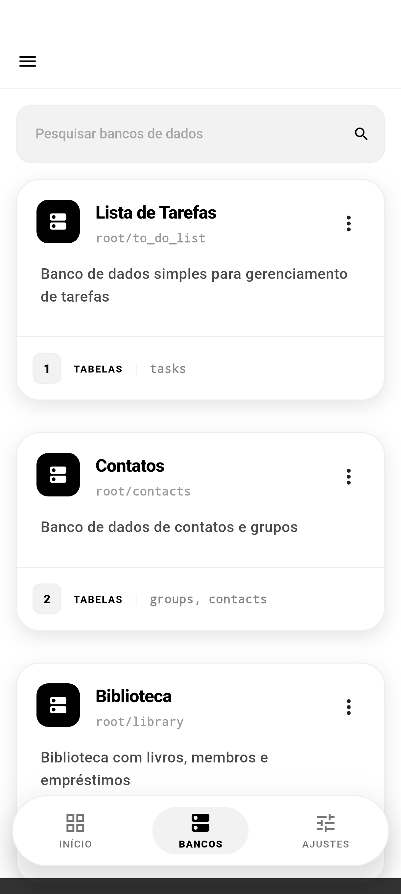
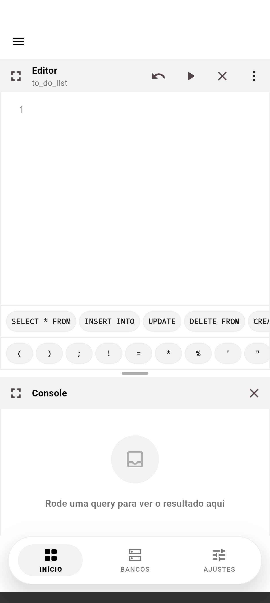
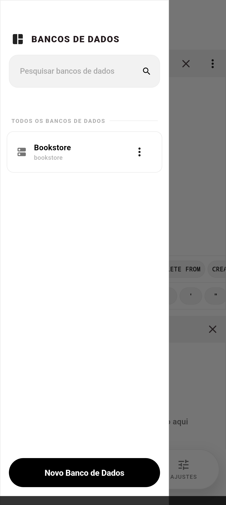
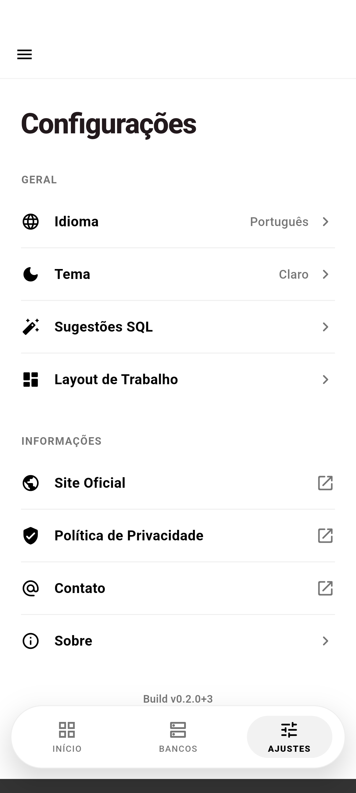
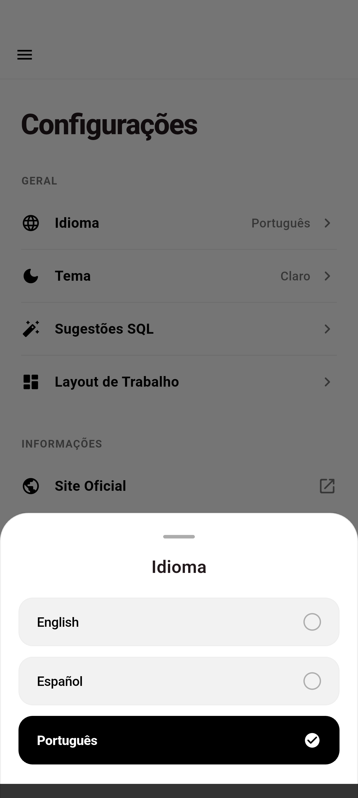
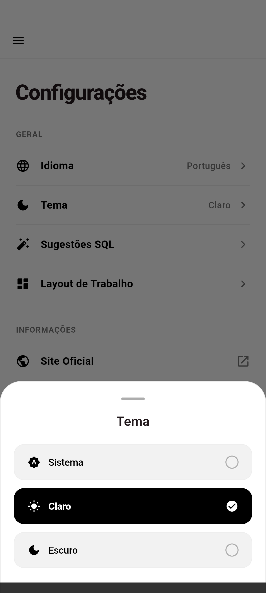
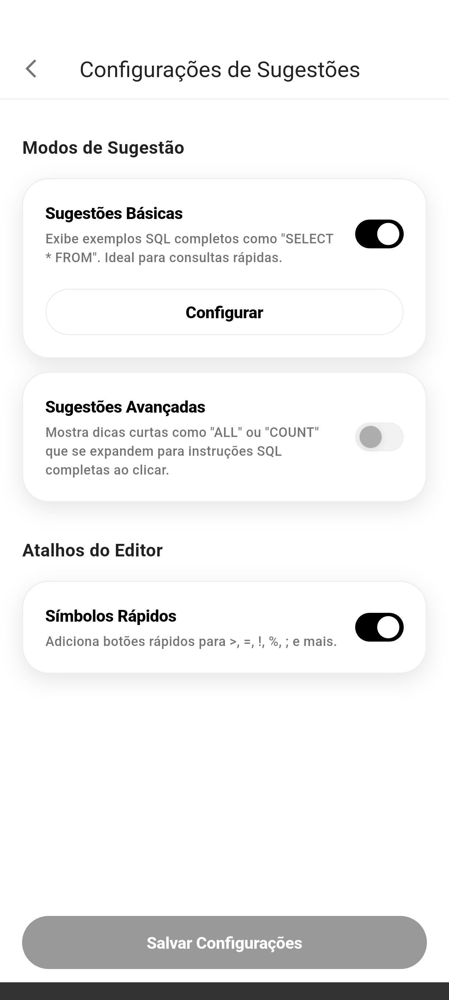
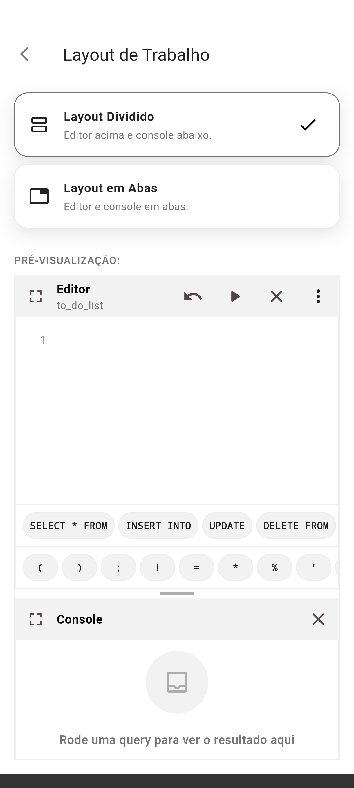

<br>
<div align="center">


</div>
<br>
<div align="center">
<a href="https://github.com/dariomatias-dev/sql_studio_app/actions/workflows/ci.yaml"></a>
<a href="https://codecov.io/gh/dariomatias-dev/sql_studio_app"></a>

<a href="LICENSE"></a>
</div>
<br>

<p align="center">
<a href="README.md">English</a> · <a href="README.es.md">Español</a> · <strong>Português (BR)</strong>
</p>

<h1 align="center">SQL Studio</h1>

<p align="center">
Um app Android para praticar SQL em bancos SQLite locais, editáveis e totalmente offline.
<br>
<a href="#sobre-o-projeto"><strong>Explore a documentação »</strong></a>
<br>
<br>
<a href="https://github.com/dariomatias-dev/sql_studio_app/issues">Reportar Bug</a>
·
<a href="https://github.com/dariomatias-dev/sql_studio_app/issues">Solicitar Funcionalidade</a>
</p>

## Índice

- [Sobre o Projeto](#sobre-o-projeto)
- [Preview](#preview)
- [Funcionalidades](#funcionalidades)
- [Stack Tecnológico](#stack-tecnológico)
- [Arquitetura](#arquitetura)
- [Como Começar](#como-começar)
- [Scripts](#scripts)
- [Testes](#testes)
- [Documentação](#documentação)
- [Contribuindo](#contribuindo)
- [Segurança](#segurança)
- [Licença](#licença)
- [Autor](#autor)

## Sobre o Projeto

**SQL Studio** é um playground de SQL para dispositivos móveis: um conjunto de bancos de dados SQLite prontos que você pode consultar, editar e resetar direto no celular, sem servidor ou conta necessários.

Cada banco de dados vem com um schema e dados de seed predefinidos. Você escreve e executa SQL real contra ele em um editor de código com destaque de sintaxe, inspeciona os resultados em um console, e pode resetar o banco ao estado original a qualquer momento. Uma visualização de esquema visual permite inspecionar tabelas, colunas e relacionamentos sem escrever uma query.

## Preview

<div align="center">










</div>

## Funcionalidades

- **Bancos de Dados SQLite Offline**: Um catálogo de bancos locais, cada um com seu próprio schema e dados de seed, prontos para consulta imediata.
- **Editor SQL**: Escreva e execute SQL com destaque de sintaxe, modo tela cheia e um console que exibe resultados e erros das queries.
- **Visualizador de Banco de Dados**: Inspecione as tabelas, colunas e estrutura de um banco de dados visualmente, sem escrever SQL.
- **Resetar Banco de Dados**: Restaure qualquer banco ao seu schema e dados de seed originais a qualquer momento.
- **Copiar Schema e Seed**: Copie o schema, os dados de seed ou ambos de um banco de dados para a área de transferência.
- **Sugestões de SQL**: Snippets de SQL básicos e avançados para agilizar a escrita de queries comuns, ativados em Configurações.
- **Layout de Workspace Configurável**: Escolha como o editor, console e visualizador são organizados na tela.
- **Múltiplos Idiomas**: Interface completa em Inglês, Português (Brasil) e Espanhol.
- **Seleção de Tema**: Tema claro, escuro ou de acordo com o sistema.
- **Busca de Bancos de Dados**: Filtre a lista de bancos de dados por nome.

## Stack Tecnológico

- **[Flutter](https://flutter.dev/)**: Toolkit de UI do Google para construir aplicações nativamente compiladas a partir de uma única base de código.
- **[Dart](https://dart.dev/)**: A linguagem de programação por trás do Flutter.
- **[Riverpod](https://riverpod.dev/)**: Gerenciamento de estado e injeção de dependência.
- **[go_router](https://pub.dev/packages/go_router)**: Roteamento declarativo.
- **[sqflite](https://pub.dev/packages/sqflite)**: Motor de banco de dados SQLite para Flutter.
- **[flutter_code_editor](https://pub.dev/packages/flutter_code_editor)** e **[flutter_highlight](https://pub.dev/packages/flutter_highlight)**: O editor de código e o destaque de sintaxe usados no editor SQL.

## Arquitetura

O app é organizado por funcionalidade (`lib/src/features/`), cada uma com suas próprias camadas `data`, `domain` e `presentation`, seguindo uma Clean Architecture simplificada e MVVM:

- **database**: o catálogo de bancos de dados, criação, exclusão, favoritos e busca.
- **database-visualizer**: a visualização visual do esquema de um banco de dados, suas tabelas, colunas e relacionamentos.
- **sql-editor**: o editor de código, seu console, e a execução de queries.
- **sql-suggestions**: os snippets básicos e avançados de SQL mostrados ao escrever uma query.
- **workspace-layout**: como o editor, console e visualizador são organizados na tela.
- **app-version**: as informações de versão do app mostradas em Configurações.

O estado é gerenciado com Riverpod (classes `Notifier`/`AsyncNotifier` expostas através de providers), a navegação com `go_router`, e a persistência através de `sqflite` e `shared_preferences`. Preocupações transversais (navegação, logging, tratamento de erros) ficam em `lib/src/core`; widgets e utilitários compartilhados por mais de uma funcionalidade, mas ainda acoplados a este app, ficam em `lib/src/shared`. Tokens de design e componentes agnósticos de apresentação (botões, cards, diálogos, estados) ficam em um pacote local próprio, `packages/app_ui`. Veja [`docs/architecture.pt-BR.md`](docs/architecture.pt-BR.md) para o detalhamento completo.

## Como Começar

O projeto fixa a versão do Flutter SDK via [FVM](https://fvm.app/), então todos os comandos abaixo usam `fvm flutter` em vez de uma instalação simples do `flutter`.

```sh
git clone https://github.com/dariomatias-dev/sql_studio_app.git
cd sql_studio_app
fvm install
fvm flutter pub get
```

Depois, rode o app em um dispositivo ou emulador conectado:

```sh
fvm flutter run
```

## Scripts

Scripts utilitários ficam em `scripts/`.

| Script | Comando | Descrição |
| --- | --- | --- |
| `screenshot` | `scripts/screenshot.sh [device-id]` | Navega o app sozinho pelas telas principais em um dispositivo ou emulador conectado e salva um screenshot de cada uma em `screenshots/<locale>/`, usado no README, na listagem da Play Store e no site oficial. |
| `verify` | `scripts/verify.sh [--skip-tests]` | O gate de qualidade local completo, espelhando o CI: regenera localizações, verifica a paridade de chaves ARB, formatação, análise, testes, e o limiar de cobertura. |
| `check_l10n` | `scripts/check_l10n.sh` | Compara as chaves de mensagem de cada `app_*.arb` contra o template em inglês e falha se faltar ou sobrar uma. |
| `check_coverage` | `scripts/check_coverage.sh <lcov> <minimo>` | Analisa um relatório lcov, exclui `lib/l10n/`, e falha abaixo do mínimo dado. |

## Testes

O projeto tem 91 arquivos de teste cobrindo repositórios, view models e widgets, mais 15 em `packages/app_ui` para seus próprios componentes, e 9 suítes em `integration_test/` cobrindo a primeira execução e o seeding, criação e exclusão de banco de dados, edição e reset do banco de dados padrão, favoritos, persistência de tema e layout do workspace, e troca de idioma. O CI exige um mínimo de 91% de cobertura de linhas para o app e seu próprio limiar para `packages/app_ui`, além do conjunto rigoroso de lints do `very_good_analysis` e do `dart format`.

Toda execução do CI envia seus relatórios `lcov` para o [Codecov](https://codecov.io/gh/dariomatias-dev/sql_studio_app) como duas flags, `app` e `app_ui`, que comentam a variação de cobertura em cada pull request. Para um relatório linha a linha localmente, gere um a partir do mesmo arquivo:

```sh
fvm flutter test --coverage
genhtml coverage/lcov.info -o coverage/html   # precisa do lcov instalado
```

## Documentação

- [Arquitetura](docs/architecture.pt-BR.md): como o código está organizado e por quê.
- [Contribuindo](docs/contributing.pt-BR.md): setup local, convenções, o que o CI verifica.
- [Política de Segurança](docs/security.pt-BR.md): como reportar uma vulnerabilidade.
- [Código de Conduta](docs/code_of_conduct.pt-BR.md).

## Contribuindo

Contribuições tornam a comunidade de código aberto um lugar excelente para aprender e criar. Toda contribuição é bem-vinda.

Antes de abrir um pull request, consulte [docs/contributing.pt-BR.md](docs/contributing.pt-BR.md) para o setup local, a convenção de mensagens de commit (Conventional Commits) e o que o CI verifica.

## Segurança

Não abra uma issue pública para reportar uma vulnerabilidade de segurança; veja [docs/security.pt-BR.md](docs/security.pt-BR.md) para saber como reportar.

## Licença

Distribuído sob a **Licença MIT**. Veja o arquivo `LICENSE` para mais informações.

## Autor

Desenvolvido por **Dário Matias Sales**:

- **Portfólio**: [dariomatias-dev](https://dariomatias-dev.com)
- **GitHub**: [dariomatias-dev](https://github.com/dariomatias-dev)
- **Email**: [dariomatias.dev@gmail.com](mailto:dariomatias.dev@gmail.com)
- **Instagram**: [@dariomatias_dev](https://instagram.com/dariomatias_dev)
- **LinkedIn**: [linkedin.com/in/dariomatias-dev](https://linkedin.com/in/dariomatias-dev)
